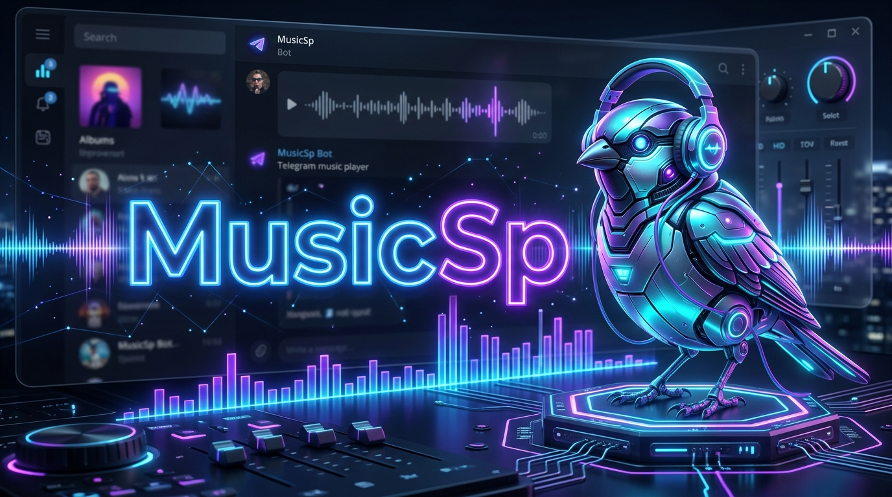

<h1 align="center"></h1>

<p align="center">
  
</p>

<p align="center">
  
</p>

<p align="center">
  
  
  
  
</p>

<h2 align="center">Delivering Superior Music Experience to Telegram</h2>

---

<p align="center">
  <a href="https://t.me/dev_Learntop">
    
  </a>
  <a href="https://t.me/Spparow_92">
    
  </a>
</p>

---

#### 🛠️  Api For Music bot
| Api Plan Name          | Daily Requests | Monthly Price  |
|--------------------|----------------|----------------|
| Month Plan          | 5,000          | ₹100          |

---

### 📌 Important Notes About API Usage

- 🔄 **Daily Reset**: Request limits reset at midnight (IST) every day.
- 🎵 **Audio-Only API**: Video support requires cookies (see YouTube section above).

---

### 🌟 Features

- 🎵 **Multiple Sources:** Play music from various platforms.
- 📃 **Queue System:** Line up your favorite songs.
- 🔀 **Advanced Controls:** Shuffle, repeat, and more.
- 🎛 **Customizable Settings:** From equalizer to normalization.
- 📢 **Crystal Clear Audio:** High-quality playback.
- 🎚 **Volume Mastery:** Adjust to your preferred loudness.

---

<h2 align="center">🚀 One-Click Deploy to Heroku</h2>

<p align="center">
  <a href="https://dashboard.heroku.com/new?template=https://github.com/DevloperSP/MusicSp">
    
  </a>
</p>

<p align="center">
  <i>Click the button above to instantly deploy Devloper Sparrow Bot on Heroku</i>
</p>

---

<h2 align="center" style="color: #1E90FF; font-family: 'Segoe UI', Tahoma, Geneva, Verdana, sans-serif;">
  🚀 Deploy on VPS Commands
</h2>
<hr style="border: 1px solid #1E90FF; width: 60%;">

### 🔧 Quick Setup

1. **Upgrade & Update:**
   ```bash
   sudo apt-get update && sudo apt-get upgrade -y
   ```

2. **Install Required Packages:**
   ```bash
   sudo apt-get install python3-pip ffmpeg -y
   ```

3. **Setting up PIP:**
   ```bash
   sudo pip3 install -U pip
   ```

4. **Installing Node:**
   ```bash
   curl -o- https://raw.githubusercontent.com/nvm-sh/nvm/v0.38.0/install.sh | bash && source ~/.bashrc && nvm install v18
   ```

5. **Clone the Repository:**
   ```bash
   git clone https://github.com/DevloperSP/MusicSp && cd MusicSp
   ```

6. **Install Requirements:**
   ```bash
   pip3 install -U -r requirements.txt
   ```

7. **Create .env with sample.env:**
   ```bash
   cp sample.env .env
   ```

8. **Editing Vars:**
   ```bash
   vi .env
   ```

9. **Installing tmux:**
   ```bash
   sudo apt install tmux -y && tmux
   ```

10. **Run the Bot:**
    ```bash
    bash start
    ```

---

### 🛠 Commands & Usage

The Devloper Sparrow Bot offers a range of commands to enhance your music listening experience on Telegram:

| Command                 | Description                                 |
|-------------------------|---------------------------------------------|
| /play <song name>     | Play the requested song.                    |
| /pause                | Pause the currently playing song.           |
| /resume               | Resume the paused song.                     |
| /skip                 | Move to the next song in the queue.         |
| /stop                 | Stop the bot and clear the queue.           |
| /queue                | Display the list of songs in the queue.     |

For a full list of commands, use /help in the bot chat.

---

<p align="center">
  <br>
  
</p>

Stay updated with the latest features, releases, and fixes for **Devloper Sparrow Bot**:

<p align="center">
  <a href="https://t.me/dev_Learntop">
    
  </a>
  <a href="https://t.me/Spparow_92">
    
  </a>
</p>

---

<p align="center">
  <br>
  
</p>

We welcome and appreciate contributions to the **Devloper Sparrow Bot** project! If you'd like to contribute, please follow these guidelines:

*   🚀 **Fork the Repository:** Create your own copy of the project.
*   🌿 **Create a Branch:** Work on a feature-specific branch with a clear name.
*   ✍️ **Commit Changes:** Write detailed, descriptive commit messages.
*   **Pull Request:** Open a pull request against our `main` branch.
*   🔍 **Review:** Our team will review your updates and coordinate feedback.

---

<p align="center">
  
</p>

This project is licensed under the **MIT License**. For complete terms and permissions, please refer to the [LICENSE](LICENSE.txt) file.

---

<p align="center">
  
</p>

We would like to express our gratitude to all contributors, developers, and supporters who have helped shape the **Devloper Sparrow Bot**:
- **Source Code Credits:** [Devloper Sparrow Bot](https://t.me/DevSpumusicbot) and [Devloper Sparrow](https://github.com/DevloperSP/MusicSp) repositories for the foundations.
- **Customization & Maintenance:** Rebranded, updated, and maintained by **DevSparrow**.
